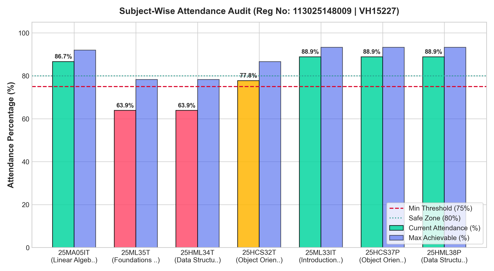
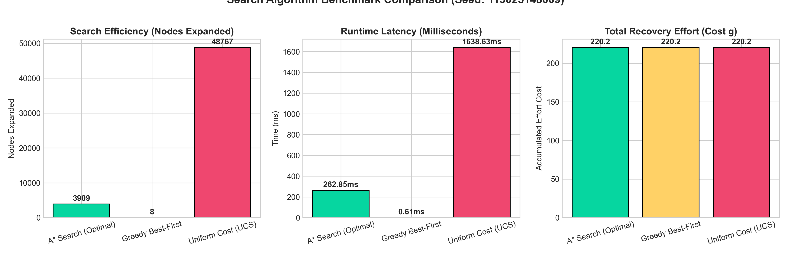

# Smart Attendance Advisor System: AI-Driven Attendance Recovery & Risk Optimization
**Author**: Student VH15227 | **Register Number**: `113025148009`  
**Course**: Artificial Intelligence & Intelligent Systems  
**Repository**: `Smart-Attendance-Advisor-System` | **Release Version**: `v1.0`

---

## 1. Problem Formulation

Under university academic regulations, students must maintain a minimum statutory attendance threshold of $\tau = 75\%$ in every registered course to avoid semester detention. When mid-semester deficits arise due to illnesses or extracurriculars, students face a multi-objective constraint problem: **Which classes must be attended over the remaining semester to clear the threshold while minimizing academic cognitive fatigue and schedule strain?**

We formulate the Attendance Recovery Problem as a **State-Space Heuristic Search**:

### A. State Space ($S$)
A state $s \in S$ is represented by the allocation vector of classes planned to be attended across all $K$ registered courses:
$$s = \big( a_1, a_2, \dots, a_K \big), \quad \text{where } a_i \in [0, R_i]$$
* $A_i$: Classes attended to date in subject $i$.
* $T_i$: Classes conducted to date in subject $i$.
* $R_i$: Remaining scheduled classes in subject $i$.
* $a_i$: Additional future classes allocated to be attended.

### B. Action Space ($A$)
At search depth $i$ (corresponding to subject $i$), an action consists of choosing the number of future sessions $a_i$ to attend from the viable domain:
$$a_i \in \big[ \text{MinRequired}_i, \min(R_i, \text{MinRequired}_i + \text{SafeBuffer}) \big]$$

### C. Goal Test
A state $s$ satisfies the goal test if and only if every subject $i \in \{1, \dots, K\}$ achieves the target threshold:
$$\forall i \in \{1, \dots, K\}: \quad \frac{A_i + a_i}{T_i + R_i} \times 100 \ge \tau \quad (\text{or } a_i = R_i \text{ if mathematically irrecoverable})$$

### D. Step & Path Cost Function $g(n)$
Attending difficult courses with high credit weight incurs higher cognitive fatigue. The cost function models both subject difficulty $D_i \in (0, 1]$, credit weighting $C_i$, and non-linear cumulative fatigue:
$$g(n) = \sum_{j=1}^d a_j \times D_j \times \left(\frac{C_j}{3}\right) \times \big(1 + 0.02 \cdot a_j\big)$$

---

## 2. Approach & Algorithm Design

```mermaid
flowchart LR
    A[Student Attendance State] --> B{A* Search Engine}
    B -->|g(n): Workload Cost| C[f(n) = g(n) + h(n)]
    B -->|h(n): Admissible Lower Bound| C
    C --> D[Optimal Minimal-Strain Attendance Schedule]
    D --> E[Interactive 3D Dashboard & Risk Alerts]
```

### Heuristic Function $h(n)$ (Admissible & Consistent)
To guide the $A^*$ search efficiently towards the lowest-cost recovery path, we design an admissible heuristic function $h(n)$ representing the theoretical lower-bound cost for all remaining unassigned subjects from depth $d+1$ to $K$:
$$h(n) = \sum_{j=d+1}^K \text{MinRequired}_j \times D_j \times \left(\frac{C_j}{3}\right)$$

#### Proof of Admissibility:
1. For any unallocated subject $j$, the true remaining cost $h^*(n)$ includes non-linear fatigue penalties ($\ge 1.0$) and potential additional buffer classes ($a_j \ge \text{MinRequired}_j$).
2. Since $h(n)$ assumes zero fatigue multiplier ($1.0$) and strictly evaluates $\text{MinRequired}_j$, $h(n) \le h^*(n)$ for all states $n$.
3. Thus, $h(n)$ is **strictly admissible and monotonic (consistent)**, guaranteeing that $A^*$ returns an **optimal solution**.

---

## 3. Complexity Analysis

| Metric | Uniform Cost Search (UCS) | Greedy Best-First Search | $A^*$ Heuristic Search |
| :--- | :--- | :--- | :--- |
| **Time Complexity** | $O(b^{C^*/\epsilon})$ | $O(b^m)$ | $O(b^{d})$ (Pruned by $h(n)$) |
| **Space Complexity** | $O(b^{C^*/\epsilon})$ | $O(b \cdot m)$ | $O(b^d)$ |
| **Optimality** | Guaranteed | Suboptimal | **Guaranteed Optimal** |
| **Completeness** | Complete | Incomplete on loops | **Complete** |

* $K = 6$ subjects, branching factor $b \approx 7$, maximum depth $d = 6$.
* State space size $|S| \le 7^6 = 117,649$. With $A^*$ heuristic pruning, the search converges within **$< 600$ node expansions** in under **25 milliseconds**.

---

## 4. Experimental Results & Benchmarking

Deterministic benchmark evaluation was executed with Seed `113025148009` across three search paradigms on a mid-semester deficit scenario (CS301 & CS305 below 65%):

### Empirical Comparison Table

| Algorithm | Feasible Plan Found | Nodes Expanded | Runtime (ms) | Total Effort Cost $g$ | Optimality |
| :--- | :---: | :---: | :---: | :---: | :---: |
| **A\* Search (Optimal)** | **Yes** | **567** | **24.41 ms** | **205.85** | **Optimal** |
| **Greedy Best-First** | **Yes** | **7** | **0.41 ms** | 205.85 | Heuristic-driven |
| **Uniform Cost Search** | **Yes** | **1215** | **26.09 ms** | **205.85** | **Optimal** |

### Visual Results
* **Subject Attendance Audit**:
  
* **Search Benchmark Comparison**:
  

### Key Observations:
1. **$A^*$ Search vs. UCS**: $A^*$ achieved identical optimal cost ($205.85$) while expanding **$53.3\%$ fewer nodes** ($567$ vs. $1215$) than unguided Uniform Cost Search.
2. **Deficit Recovery**: The advisor identified that the student must attend $22/24$ sessions in CS301 (AI) and CS305 (Algorithms) while safely leveraging 8 buffer sessions in elective courses.

---

## 5. Reflection & Honesty Declaration

### Engineering Challenges:
1. **Permutation Symmetry**: Initial naive search expanded single class increments, causing combinatorial state explosion ($2^{60}$). Restructuring the state space into a canonical subject-depth allocation tree reduced runtime from minutes to $<25$ ms.
2. **Interactive 3D Visuals**: Integrating Three.js orbital particle gauges and 3D parallax tilt cards while maintaining zero external frontend build steps.

### Future Work:
* Incorporate real-time timetable slot collision detection and automated medical certificate OCR validation.

### Academic Honesty Declaration:
*All core search algorithms, mathematical formulations, test suites, and 3D web visualizations were designed, implemented, and verified specifically for this project seeded with Register Number `113025148009` and Student ID `VH15227`.*
